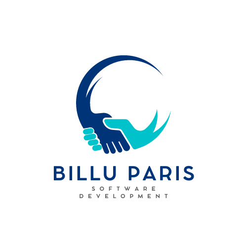

# TSSR-2405-P3-G1-BuildYourInfra-BillU

# Projet 3 : Construction d’une infrastructure réseau pour BillU

  

## Présentation du Projet

**Contexte :** BillU, une filiale de RemindMe spécialisée dans le développement de logiciels de facturation, a besoin d'une nouvelle infrastructure réseau. Notre équipe de cinq étudiants en formation de technicien support systèmes et réseaux a été mandatée pour réaliser ce projet. Le siège de BillU est situé à Paris, 20ème arrondissement, et compte 167 employés répartis en 9 départements.

**Objectifs Finaux :**

- Analyser l’état actuel de l’infrastructure réseau.
- Proposer une architecture réseau sécurisée et évolutive.
- Implémenter et configurer le réseau.
- Documenter toutes les étapes du projet.
- Assurer une collaboration efficace en équipe.

## Introduction

BillU, filiale du groupe international RemindMe, souhaite moderniser son infrastructure réseau pour répondre aux besoins croissants de ses équipes. Actuellement, l'infrastructure est basique avec un réseau wifi fourni par une box FAI, sans serveur dédié, ni sécurité avancée. Notre mission est de concevoir et de mettre en place une infrastructure réseau robuste et évolutive.

## Structure de la Documentation par Sprint  :
# Sprint 1 - Analyse de l'État Actuel

## Objectifs du sprint

**Mise en Place et Gestion Initiale de l'Infrastructure AD et des VMs**

1. **AD-DS - Création d'un domaine AD**
    1. Un serveur Windows Server 2022 GUI avec les rôles AD-DS, DHCP, DNS
    2. Un serveur Windows Server 2022 Core avec le rôle AD-DS
    3. Les deux serveurs sont des DC du domaine et ont une réplication complète gérée
2. **Gestion de l'arborescence AD**
    1. Création des OU
    2. Création des groupes
    3. Création des comptes
3. **Création d'une VM Serveur Linux Debian**
    1. Mise sur le domaine AD
    2. Accessible en SSH
4. **Création d'une VM client**
    1. Sur le domaine AD
    2. Avec un compte utilisateur ayant un accès SSH sur le serveur Linux
5. **Automatisation**
    1. Automatisation complète à partir du fichier CSV
6. **Documentation**
    1. Création des structures de documentation (README.md, Install et user guide)

## Récapitulatif des Tâches

| Personne | Rôle               | Tâches                                                                                                                                                                                                  |
| -------- | ------------------ | ------------------------------------------------------------------------------------------------------------------------------------------------------------------------------------------------------- |
| Mina     | Développeuse       | - Etablissement d'une partie de la liste de matériel   - [Notre solution AD](Ressources/Doc_Active_Directory.md)   - [Notre solution Serveur de Backup](Ressources/Doc_créer_une_backup_de_notre_serveur.md)|
| Julie    | Développeuse       | - Découpage réseau  [Accéder à mon document](Ressources/decoupage_réseau.md)   |
| Joris    | Product Owner (PO) | - Script d'ajout d'utilisateurs AD   - [Doc étape 3](S09/S09_Install.md)                                                                                                                                                   |
| Nicolas  | Développeur        | - Installation du serveur Windows GUI (DHCP, DNS) - Installation de Windows Core (réplication)   - [Doc étape 1](S09/S09_Install.md)                                                                                                      |
| Mohammed | Scrum Master (SM)  | - Création VM serveur Debian - Création VM client Windows 10 - Ajout des VMs sur l'AD et configuration des pare-feu - Installation et configuration du SSH - [Doc étape 2](S09/S09_Install.md) |

## Choix Techniques

- VM Serveur Linux Debian
- VM client Windows 10
- Serveur Windows Server 2022 GUI
- Serveur Windows Server 2022 Core

## Difficultés Rencontrées :

- **Conflits de services sur le serveur AD :** Avoir plusieurs rôles (AD-DS, DHCP, DNS) sur un même serveur peut entraîner des conflits de services et des risques accrus en termes de sécurité.
- **Capacité de stockage insuffisante pour les sauvegardes :** Les sauvegardes régulières des données AD et des machines virtuelles nécessitent une grande capacité de stockage, ce qui peut dépasser les capacités actuelles des supports existants.  
- **Configuration de la connexion SSH sur des machines ajoutées à l'AD :** La configuration du SSH pour les machines intégrées à l'AD a présentée des difficultés en termes de permissions et de gestion des clés.

## Solutions Trouvées :

- **Isolation des rôles :** Pour réduire les conflits de services et améliorer la sécurité, il est proposé d'isoler le rôle DHCP sur un autre serveur. Cette solution permet de réduire le nombre de ports et services ouverts sur le serveur AD, minimisant ainsi les vecteurs d'attaque potentiels.
- **Nouveaux supports de stockage de sauvegarde :** Mettre en place de nouveaux supports de stockage dédiés aux sauvegardes, tels  des solutions de stockage en cloud, ou en physique pour garantir suffisamment d'espace et améliorer la fiabilité des sauvegardes.
- **Configuration SSH et gestion des clés :** Personnalisation du module PAM et des fichiers de configuration SSH et SSSD

## Améliorations Possibles :

- **Isoler le rôle DHCP sur un autre serveur pour optimiser la sécurité :**
    
    - **Description :** Déplacer le rôle DHCP vers un serveur dédié afin de réduire les risques de sécurité associés à la concentration de plusieurs rôles critiques sur un même serveur.
    - **Avantages :** Amélioration de la sécurité en réduisant les ports et services ouverts sur le serveur AD, simplification de la gestion des services, réduction des risques de conflits entre services.
- **Mettre en place de nouveaux supports de stockage de back-up :**
    
    - **Description :** Utiliser des solutions de stockage supplémentaires ou de remplacement pour les sauvegardes.
    - **Avantages :** Augmentation de la capacité de stockage disponible pour les sauvegardes, amélioration de la fiabilité et de la sécurité des sauvegardes, possibilité de restaurer les données plus rapidement en cas de perte ou de corruption des données.

**Optimisation de la configuration SSH :**

- **Description :** Automatiser et standardiser la configuration SSH sur toutes les machines ajoutées à l'AD pour garantir une sécurité et une gestion des accès optimales.
- **Avantages :** Amélioration de la sécurité des connexions SSH, réduction du temps et des erreurs de configuration, facilité de gestion des accès pour les utilisateurs.
  

---
# Sprint 2 : Implémentation et Configuration du Réseau

## Objectifs du sprint

1. **GPO de sécurité** - Création d'au moins 10 GPO dont 7 dans la liste ci-dessous :
    1. Politique de mot de passe (complexité, longueur, etc.)
    2. Verrouillage de compte (blocage de l'accès à la session après quelques erreurs de mot de passe)
    3. Restriction d'installation de logiciel pour les utilisateurs non-administrateurs
    4. Gestion de Windows update (heure, délai avant installation, etc.)
    5. Blocage de l'accès à la base de registre
    6. Blocage complet ou partiel au panneau de configuration
    7. Restriction des périphériques amovibles
    8. Gestion d'un compte du domaine qui est administrateur local des machines
    9. Gestion du pare-feu
    10. Écran de veille avec mot de passe en sortie
    11. Forçage du type d'utilisation sécurisée du bureau à distance
    12. Limitation des tentatives d'élévation de privilèges
    13. Définition de scripts de démarrage pour les machines et/ou les utilisateurs
    14. Politique de sécurité PowerShell

2. **GPO standard** - Création d'au moins 5 GPO dont 3 dans la liste ci-dessous :
    1. Fond d'écran
    2. Mappage de lecteurs
    3. Gestion de l'alimentation
    4. Déploiement (publication) de logiciels
    5. Redirection de dossiers (Documents, Bureau, etc.)
    6. Configuration des paramètres du navigateur (Firefox ou Chrome)

3. **Création d'un serveur GLPI** - Sur Debian 11 ou 12 en CLI
    1. Synchronisation AD
    2. Gestion de parc : Inclusion des objets AD (utilisateurs, groupes, ordinateurs)
    3. Gestion des incidents : Mise en place d'un système de ticketing
    4. Accès et gestion à partir d'un client

4. **Scripts d'automatisation** : 
    1. Sur un serveur Debian, installation de GLPI à partir d'un fichier de configuration qui contient par exemple le nom de la base de données, le nom du compte, etc.
    2. Sur un Windows Server Core, installation du rôle AD-DS, ajout à un domaine existant. On se base sur un fichier de configuration qui contient le nom du serveur, l'adresse IP du DNS, le nom du domaine, etc.

## Récapitulatifs des Tâches

| Personne   | Rôle                   | Tâches                                                                                                          |
|------------|------------------------|-----------------------------------------------------------------------------------------------------------------|
| Nicolas    | Scrum Master (SM)      | Développement d'un script automatisé pour déployer le rôle AD DS sur Windows Server Core en se basant sur un fichier de configuration. |
| Mohammed   | Développeur            | Synchro AD, Gestion de parc et d'incidents [Doc étapes 2_à_4](S10/S10_Install.md), accès et gestion à partir d'un client [User_Guide](S10/S10_User_Guide.md), support script bash, création du logo, [Arborescence_AD](Ressources/arbor_ad.png) et présentation pwp                                                                                        |
| Joris      | Développeur            | Création et configuration des GPO pour renforcer la sécurité et standardiser les paramètres sur les postes de travail Windows. |
| Julie      | Développeuse           | Rédaction d'une documentation détaillée pour chaque étape des projets.                                          |
| Mina       | Product Owner (PO)     | Déploiement d'un serveur GLPI sur Debian à travers un script bash et un fichier de configuration.               |

## Choix Techniques

- VM Serveur Linux Debian
- VM client Windows 10
- Serveur Windows Server 2022 GUI
- Serveur Windows Server 2022 Core

## Difficultés Rencontrées

- **Script PowerShell** : Le script n'a pas exploité les variables correctement comme prévu. L'adresse IP indiquée est invalide en raison de son attribution antérieure. Bien que le script fonctionne globalement, une dernière erreur persiste concernant l'adresse IP dans le fichier de configuration.
- **Gestion des Objets de Stratégie de Groupe (GPO)** : Les GPO sont actuellement en anglais.
- **Script Bash** : Des erreurs ont été observées au niveau des variables, des boucles, et des logs.

## Solutions Trouvées

- **Script PowerShell** : Une adresse IP libre a été utilisée pour résoudre l'erreur de configuration.
- **Gestion des Objets de Stratégie de Groupe (GPO)** : Malgré leur complexité, les GPO ont été traduits en français.
- **Script Bash** : Correction apportée aux logs.

## Améliorations Possibles

- **Pour le Script PowerShell** : Améliorer la gestion et l'utilisation des variables afin d'éviter les erreurs futures.
- **Pour les GPO** : Automatiser la traduction pour éviter les complications manuelles.
- **Pour le Script Bash** : Réviser la gestion des variables et des boucles pour garantir un fonctionnement correct.

  ---
# Sprint 3 : Configuration de la sécurité réseau avec pfSense et VyOS sur Proxmox, et gestion de la télémétrie sur Windows 10/11

## Objectifs du sprint

- Prise en main du pare-feu pfSense et configuration des règles de pare-feu (WAN et LAN).
- Configuration du routeur VyOS sur l'infrastructure Proxmox en lien avec le PFsense.
- Gestion de la télémétrie sur les clients Windows 10/11, via script ou GPO.
- Clone d'un template de routeur VyOS sur Proxmox avec documentation associée.

## Récapitulatifs des Tâches :
  

 | Personne   | Rôle                   | Tâches                                                                                                           |
|------------|------------------------|------------------------------------------------------------------------------------------------------------------|
| Nicolas    | Développeur      | - Prise en main du pare-feu pfSense et configuration des règles de pare-feu (WAN et LAN)                          |
| Mohammed   | Développeur            | - Clone d'un template de routeur VyOS sur Proxmox avec documentation associée.                                    |
|            |                        | - [Doc_Configuration_VYOS](S11/S11_Install.md)                                                                        |
|            |                        | - Configuration du routeur VyOS sur l'infrastructure Proxmox en lien avec le PFsense.                             |
| Joris      | Scrum Master (SM)             | - Création et configuration des GPO pour renforcer la sécurité et standardiser les paramètres sur les postes de travail Windows. |
| Julie      | Product Owner (PO)           | - Configuration du routeur VyOS sur l'infrastructure Proxmox en lien avec le PFsense.                             |
| Mina       | Développeur      | - Gestion de la télémétrie sur les clients Windows 10/11, via script ou GPO. [Doc_télémétrie](S11/S11_Install.md)                                       |

   
## **Choix Techniques :**
  
- Utilisation de pfSense pour la gestion du pare-feu
- Utilisation de VyOS comme routeur sur l'infrastructure Proxmox
- Implémentation des GPO pour la gestion de la télémétrie sur Windows 10/11
     
## **Difficultés Rencontrées :**
    
    - Problèmes de routage entre les différents sous-réseaux
      
## **Solutions Trouvées :**
    
    - Ajustement des interfaces et des routes sur VyOS pour assurer une communication fluide entre les sous-réseaux
      
## **Améliorations Possibles :**

    - Mettre en place une DMZ pour renforcer notre sécurité réseau

  ---
# Sprint 4 : Mise en Place des Dossiers Partagés, Sécurité et Sauvegarde sur AD, et Automatisation des Tâches AD

## Objectifs du sprint

1. **Dossiers Partagés :**
    - Mettre en place des dossiers réseaux pour les utilisateurs
    - Stockage des données sur un volume spécifique de l'AD
    - Sécurité de partage des dossiers par groupe AD
    - Mappage des lecteurs sur les clients par GPO 
    - Chaque utilisateur a accès à :
        - Un **dossier individuel**, avec une lettre de mappage réseau **I**, accessible uniquement par cet utilisateur
        - Un **dossier de service**, avec une lettre de mappage réseau **M**, accessible par tous les utilisateurs d'un même service.
        - Un **dossier de département**, avec une lettre de mappage **N**, accessible par tous les utilisateurs d'un même département.

2. **Stockage Avancé :**
    - Mettre en place du RAID 1 sur le volume système des serveurs 

3. **Sauvegarde :**
    - Mettre en place une sauvegarde du volume qui contient les dossiers partagés des utilisateurs
    - Les sauvegardes seront placées sur un volume spécifique
    - Il y a au minimum 1 sauvegarde par semaine

4. **Mot de Passe Administrateur Local :**
    - Mise en place de LAPS
    - Console de gestion sur un AD en GUI
    - Installation sur les postes clients par GPO 

5. **Déplacement des Machines dans l'AD :**
    - Automatisation du placement dans la bonne OU
    - Suivant le nom d'une machine et/ou la valeur d'un attribut AD
    - Automatisation par script exécuté par une tâche planifiée sur le serveur

6. **Restriction d'Utilisation des Machines :**
    - Bloquer la connexion pour les utilisateurs non-admin (domaine et local)
    - Connexion autorisée de 7h30 à 20h, du lundi au samedi

7. **Objectif Personnalisé :**
    - Mise en place d'un mécanisme pour récupérer rapidement en cas de défaillance :
        - Clone miroir
        - Script de restauration complet ou partiel d'OS
        - Script de restauration de configuration

## Récapitulatifs des Tâches :
  
| Personne   | Rôle                   | Tâches                                                                                                           |
|------------|------------------------|------------------------------------------------------------------------------------------------------------------|
| Nicolas    | Développeur            | - Automatisation du placement des machines dans la bonne OU (Objectif 5)                                         |
| Mohammed   | Développeur            | - Mise en place de LAPS et gestion par GPO  (Objectif 4)                                                |
| Joris      | Scrum Master (SM)      | - Mise en place des dossiers partagés et gestion des accès (Objectif 1)                                          |
|            |                        | - Restriction horaire d'utilisation des machines (Objectif 6)                                                    |
| Mina       | Développeur            | - Mettre en place du RAID 1 sur le volume système des serveurs (Objectif 2)                                      |
|            |                        | - Mise en place d'une sauvegarde du volume des dossiers partagés (Objectif 3)                                    |
| Julie      | Product Owner (PO)     | - Mise en place d'un mécanisme de récupération rapide en cas de défaillance (Objectif 7)                         |

## **Choix Techniques :**
  
- Utilisation de GPO et scripts pour la gestion des dossiers partagés et des accès
- Implémentation de RAID 1 pour améliorer la fiabilité des serveurs
- Utilisation de LAPS pour sécuriser les mots de passe administrateurs locaux
- Automatisation des tâches AD pour simplifier la gestion et améliorer l'efficacité
- Mise en place de mécanismes de sauvegarde et de récupération rapide pour assurer la continuité des services

## **Difficultés Rencontrées :**
    
    - Problèmes de configuration des partages réseau et des permissions
    - Difficultés dans la mise en place et la gestion de LAPS
    - Complexité de l'automatisation des tâches AD et du placement des machines dans les bonnes OU
      
## **Solutions Trouvées :**
    
    - Utilisation d'outils de diagnostic et de gestion des partages pour résoudre les problèmes de permissions
    - Formation et documentation sur l'utilisation de LAPS et les bonnes pratiques de sécurité
    - Scripts optimisés et planifications de tâches automatisées pour gérer le placement des machines dans l'AD
      
## **Améliorations Possibles :**

    - Automatisation accrue des tâches de gestion et de maintenance des serveurs et des postes clients
    - Surveillance continue et alertes en temps réel pour anticiper les problèmes de sécurité et de performances
    - Formation continue des équipes sur les nouvelles technologies et les bonnes pratiques de gestion réseau et de sécurité

---
#### Sprint 5 : 

- **Membres du Groupe (Rôles) :**
    
    - Scrum Master (SM) : 
    - Product Owner (PO) : 
    - Developpeurs : 
- **Choix Techniques :**
    
    - 
- **Difficultés Rencontrées :**
    
    - 
    - 
- **Solutions Trouvées :**
    
    - 
    - 
- **Améliorations Possibles :**

    -

  ---
#### Sprint 6 : 

- **Membres du Groupe (Rôles) :**
    
    - Scrum Master (SM) : 
    - Product Owner (PO) : 
    - Developpeurs : 
- **Choix Techniques :**
    
    - 
- **Difficultés Rencontrées :**
    
    - 
    - 
- **Solutions Trouvées :**
    
    - 
    - 
- **Améliorations Possibles :**

    -

---
#### Sprint 7 : 

- **Membres du Groupe (Rôles) :**
    
    - Scrum Master (SM) : 
    - Product Owner (PO) : 
    - Developpeurs : 
- **Choix Techniques :**
    
    - 
- **Difficultés Rencontrées :**
    
    - 
    - 
- **Solutions Trouvées :**
    
    - 
    - 
- **Améliorations Possibles :**

    -

  ---
#### Sprint 8 : 

- **Membres du Groupe (Rôles) :**
    
    - Scrum Master (SM) : 
    - Product Owner (PO) : 
    - Developpeurs : 
- **Choix Techniques :**
    
    - 
- **Difficultés Rencontrées :**
    
    - 
    - 
- **Solutions Trouvées :**
    
    - 
    - 
- **Améliorations Possibles :**

    -

  ---
#### Sprint 9 : 

- **Membres du Groupe (Rôles) :**
    
    - Scrum Master (SM) : 
    - Product Owner (PO) : 
    - Developpeurs : 
- **Choix Techniques :**
    
    - 
- **Difficultés Rencontrées :**
    
    - 
    - 
- **Solutions Trouvées :**
    
    - 
    - 
- **Améliorations Possibles :**

    -

  ---
#### Sprint 10 : 

- **Membres du Groupe (Rôles) :**
    
    - Scrum Master (SM) : 
    - Product Owner (PO) : 
    - Developpeurs : 
- **Choix Techniques :**
    
    - 
- **Difficultés Rencontrées :**
    
    - 
    - 
- **Solutions Trouvées :**
    
    - 
    - 
- **Améliorations Possibles :**

    -

  ---
#### Sprint 11 : 

- **Membres du Groupe (Rôles) :**
    
    - Scrum Master (SM) : 
    - Product Owner (PO) : 
    - Developpeurs : 
- **Choix Techniques :**
    
    - 
- **Difficultés Rencontrées :**
    
    - 
    - 
- **Solutions Trouvées :**
    
    - 
    - 
- **Améliorations Possibles :**

    -
